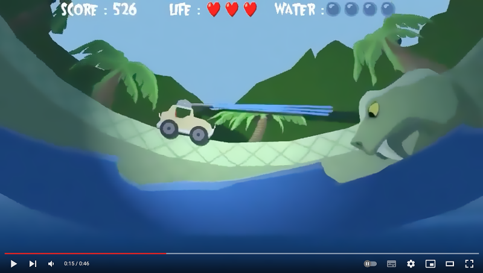
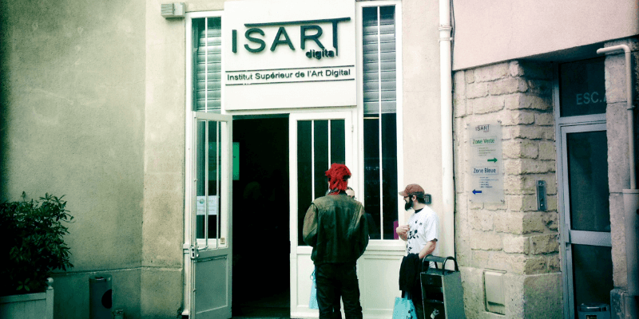
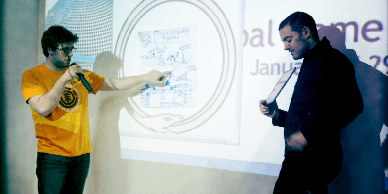
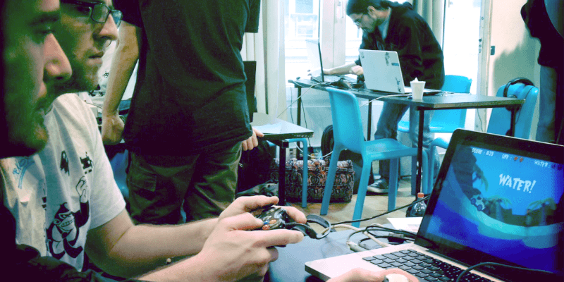
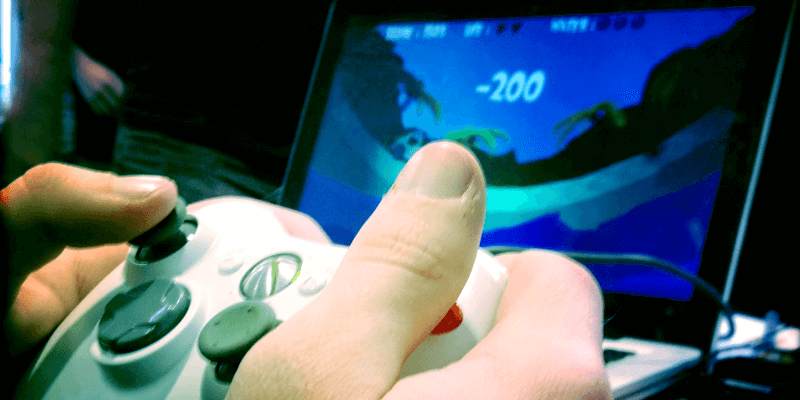

#  GGJ2012 Jurasnake Park

:joystick: _A 2 players game made for the Global Game Jam 2012, Isart Digital, Paris._

The game is implemented in [Squirrel](https://github.com/albertodemichelis/squirrel), based on [GameStart3D](https://www.youtube.com/@GameStart3D/videos).
It was created during the Global Game Jam 2012, where the theme was `Ouroboros`.

_The game was done in 48h (Global Game Jam rules)._

:Joystick: Action game created during GGJ2012 at Isart Digital Paris. Two players, the first one controls the jeep, the second one aims the water cannon. The goal is to remain as long as possible on track, avoiding obstacles and collecting different bonuses.

## :memo: Devlog

_During the GGJ12, I kept a devlog that was published on the [Game Side Story](https://www.gamesidestory.com/2012/02/03/carnet-de-bord-global-game-jam-2012-paris/) website. Here is it, translated into English._

### 3:30pm, Friday, January 27, 2012

Arrival at the GGJ, equipped with our t-shirts and badges, we wait in the courtyard of [Isart Digital](http://www.isartdigital.com/) for all participants to arrive. Some faces are familiar, including a VRGeeks team specialist carrying an entire cube of sensors, helmets and other accelerometers.

The majority of the jammers present are men... We still have a bit of a way to go to achieve parity! In the meantime, I'm refining my mini framework under [GameStart](http://www.gamestart3d.com/) (screen change routines, Xbox Paddle reading...)

### 5pm

Official launch of the GGJParis.

Olivier Lejade, founder of [MekenSleep](http://www.mekensleep.com/) studio, presents the event and its proceedings, before passing the baton to [Swing Swing Submarine](http://www.swingswingsubmarine.com/), two recognized developers from Montpellier, authors of [Blocks That Matter](http://www.swingswingsubmarine.com/games/blocks-that-matter/) (XBLA, STEAM). They have already participated in previous Jams, and they remind us that while being an indie developer sometimes allows for greater creative freedom, it's not the fastest path to financial independence.

The time for the video keynote arrives, with international accents. Gonzalo Frasca (PowerfulRobot), Brenda Garno (Jagged Alliance), John Romero (Doom), Will Wright (SimCity), Tomohisa Kuramitsu (Baiyon.com) take turns sharing sensitive and touching anecdotes about their respective experiences. Romero & Garno talk about their human collaboration, Frasca talks about the strong link between empathy and work relationships and the importance of improving at every competition, Wright presents his methodology against a background of wandering ants and Kuramitsu surprises us with his DJ Scratching practices using 8bit video cartridges.

At the end of this keynote, rich in wise and valuable teachings, Olivier Lejade announces the theme: it's not a word, but an [image](https://www.gamesidestory.com/wp-content/gallery/contenu-divers/ouroboros-preview.png)... A snake biting its tail, in a cyclical and circular movement, the Ouroboros, for the most literate among us.

Ready, set, go! We have 30 minutes to come up with a concept, which each of us will have to develop and present to the others in 30 seconds. Guaranteed stress, doubled by the difficulty of getting to the point in so little time. I personally won't have time to present my entire concept, which is much simpler than most of the crazy ideas coming from my co-jammers.

Among the ideas that caught my attention, some of which are brilliantly original or hilarious, Alexis Moroz, an experienced game designer I had the opportunity to see in action at the GGJ2011, will propose a concept that will, unfortunately, not be developed. But the end of GGJ2012 Paris will show me how he might be dazzling and efficient!

### 6pm (more or less)

The recruitment session is launched. Everyone roams around Isart, a pizza in one hand (perfect catering, as usual with Isart Digital) and their game concept in the other, looking for collaborators.

Teams of 2 or 3 (!) coders are ardently looking for graphic designers, and on the opposite side, game designers & artists are doing everything to bring a coder to work on their project.

For my part, I decide to team up with [Florian Belmonte](http://www.florianb.com/), an illustrator & 2D animator from the same city as me, but with whom I've never worked. He's OK with developing my game concept. The risk is relatively reduced on purpose: it's my first GGJ as a coder and I don't want to sink the ship!

All we need now is to find a sound designer, a task that will turn out to be more complex than expected, Olivier Lejade having planned to integrate a limited number of them into the Jammers' staff. In the end, Eddy is more than happy to join us, knowing that he will have the opportunity to work on 1 or 2 other projects in parallel. The Global Game Jam is also about this: plunging into 48 hours of pure rush with perfect strangers!

After a few hours, as Olivier had announced, the teams are formed. Back to the auditorium, and each team presents the projects that have been collectively selected. No less than 21 games are in gestation, a record for Isart & the GGJ Paris.

### 10pm

Our small team is now assembled! A 2D artist, a sound designer, and a coder will be working tirelessly on "Jurasnake Park". We unpack our gear, each person gets set up, connects their computer to Isart's local network and starts preparing their tools.

Our game concept is as follows: A jeep speeds along the back of an endless serpent, and must avoid its gaping mouth by jumping. The first player controls the jeep and the jumps, the second player controls a water cannon that must douse the snake to make it harmless. We hope to fulfill one of the achievements proposed by the GGJ2012: A hardcore & a casual player team up.

Given it's a relatively simple concept and our team is small, the game design discussions are quite short. Florian and I draft an initial list of the 2D assets he will need to produce, as well as an initial quality level. There's no point in aiming for a polished finish when the dimensions and proportions of the game elements could still change.

Meanwhile, Eddy is preparing a list of strictly necessary sounds for this type of game: engine noise, jumping, jungle ambience.

In keeping with the GGJ principle of open projects, I decide, for technical reasons, to open a Google Code Project. It will serve me as a backup server and SVN, a tool I find hard to do without when writing code. You can find it here: [Google Code Project](https://code.google.com/p/ggj2012-jurasnake-park/).

Our goal, around 10pm, is to have a working executable by early morning. Florian and I also intend to get enough sleep during this first night to maintain maximum clarity and working capacity for the end of the 48 hours.

### 2am, Saturday, January 28, 2012

After 4 hours of graphics, sound design, and coding, we have a working prototype!

The snake endlessly spins, the jeep moves on its back, jumps, and hits its mouth (which is currently closed).

I have time to make a video capture and upload the result of iteration #0 (a coder often counts from zero, a quirk or snobbery?). Hooray! We can go and rest!

[Our prototype](http://www.youtube.com/watch?v=Np6DMsygroM), first iteration.

### 8:30am, Saturday, January 28, 2012

Back at the Isart Digital premises. We find the “WTFs” team there ([Welcome To the Freak Show](https://www.youtube.com/watch?v=x4Z6YP9xnsc)). They have spent almost an all-nighter on their project, whose prototype, although visually basic, already has interesting gameplay.

As I boot up my machine, I find yesterday's prototype and quickly consider the list of priorities I thought about during my (short) night:

- Setting up lighting that highlights Florian's work and our staging choices.
- Implementing the Xbox paddle to start really testing the gameplay.
- Implementing a score and a limited number of lives, conventional player motivation elements that seem essential to me.

Once this game mechanic is in place, I can then add the Game Over screens, as well as the sound effects and music prepared by Eddy who seems to have spent an all-nighter with the WTFs. This way, we have a complete gameplay loop: Title screen, game screen, and game over screen.

In the meantime, Olivier Lejade goes around the projects, tests the first prototypes, advises the teams. After testing our game embryo, his question falls, quick and concise: "What's the challenge ?" We discuss some vague paths to develop the gameplay and he advises us to make decisions in terms of game design.

[Our prototype, second iteration](http://www.youtube.com/watch?v=MTBm25S97Ac), in the middle of the day.

If I decided from the start of the Game Jam not to include a Game Designer in the team, it's mainly for fear of not being able to manage both the designer's ideas and the graphic assets. I know that next year, if I come back to the GGJ, I'll have to improve on this point!

As I dive back into my initial game design document, I hear Alexis's team behind us, completely "overclocked", discussing the mechanisms of their game: SnakeDemocracy with Olivier Lejade. Pursuing the "Over 1024 simultaneous players" achievement, they decided to turn the classic Snake game into an electoral issue. Players can log on to the [SnakeDemocracy](http://globalgamejam.org/2012/snake-democracy) server, vote to direct the snake right, left, or straight ahead. Via Twitter, activists can participate in each campaign, adding apples (!) to the game grid. In 48 hours, I consider this an achievement in game design and coding!

### 2pm, Saturday, January 28, 2012

The afternoon will be intense. Florian is preparing bonus sprites and I'm starting to implement a bonus and trap spawn system, something I hadn't anticipated at all from the start.

By late afternoon, the player is able to drive, jump over the snake, shoot it with the water cannon, and pick up bonuses to repair the jeep.

With a life counter and a score, it's starting to look like a game, and the other Jammers who kindly test the prototype are pressing me with questions: "And you, what's your score?"

After the third tester who asks me the same thing, I realize that:

- I don't have the mindset of a gamer, being unable to answer the question.
- I need to implement a high score, with a save feature if possible.

By the end of the day, the bonuses are functional, the high score shows up, Florian's decorative elements are almost all in place, and the snake's head is animated.

To add a nuance to the challenge, we decide on two alternative endings:

- If the player collides with the closed mouth of the snake, the game ends because the jeep is damaged. A game over screen will show the jeep in pieces.
- If the player drives the jeep into the snake's open mouth, the game stops directly because the jeep has been swallowed. Florian has drawn an ending screen that is reminiscent of Jonah's misadventures in the whale's belly.

### 10pm, Saturday, January 28

After several hours of determined attempt to correctly detect the collision between the jeep and the gaping mouth of the snake, I decide to comment out all of this part of the source code.

Physical collisions are not accurately reporting this event to me, and the use of triggers also proves fruitless.

Rather than risk exhausting ourselves on this idea, we decide to use the two end screens randomly. The game works, although it's particularly unbalanced. The prototype is however well advanced, it's time to take a second night's rest.
### 8:30am, Sunday, January 28, 2012

Back on my code, after a night partly spent thinking about the last priorities, I add a final challenge element, drawn by Florian: indigenous people wearing masks.

Again, after 1 hour of various implementations, I fail to test the "water cannon / indigenous" collisions. So we decide once again to abandon a feature.

I just take the time to make a [video capture](http://www.youtube.com/watch?v=2AjD8A8drUo) of the almost-last iteration of the game, to register the game on the Global Game Jam website.

Having set a deadline around 11 AM for a testable version, I take care of the last game design adjustments: new obstacles to increase the diversity of the game and the last sound effects produced by Eddy, as well as cosmetic elements around the GUI.

The randomness of traps and bonuses remains quite rigid, as I've reached the limit of what my [spawning](http://en.wikipedia.org/wiki/Spawning_%28video_gaming%29) code could generate. This is also a point I need to improve at my next Jam.

### 12pm

Last second stress: the bonuses, which were working an hour ago, remain inert when the player picks them up. I probably broke something in my code, which sometimes happens when programming, and even more so in a hurry.

While I start to track down this last-minute bug, Florian goes downstairs to fetch Sandwiches & Wraps, offered by the Isart staff. Once again, SVN is going to save my life: I ask it to give me the list of changes made to the source code in the last hour. In a few seconds, a line that I had deleted catches my attention: the bonuses are no longer correctly initialized. I restore the line of code in question. Phew, everything works again!

While discussing with another Jammer, a student at Isart, who watches me test the game one last time, I urgently add a huge "Game Over" to the end illustrations produced by Florian: "You should add a 'Game Over', by convention" ... So there are conventions in video games? Like in theater or cinema? I realize a little more what it's like to learn video games in a school 🙂

### 1 pm

The official project completion deadline is approaching, but we want to make the game accessible to other Jammers as soon as possible. We still have 2 good hours to correct the last playability issues, but I prefer to release the game as is, especially since my fingers are starting to get numb. In the hours to come, many Jammers and journalists covering the GGJ will take turns on Jurasnake Park. One of them will manage to break a high score that remains undefeated to this day.

One of our neighboring Jammers points out to me that the game is still a bit hardcore, and that the difficulty deserves to be adjusted. When I explain to him that I wanted to wrap up the release as soon as possible so that everyone could test the game, he replies: "Ah? So you skipped the play-test phase?"

Releasing a game by avoiding the testing phase to take advantage of a favorable launch window? This pattern suddenly seems eerily familiar ...

## 2pm

While Jurasnake Park is torturing the players who try it, I decide to check out the finished projects from our fellow Jammers. After a few minutes, I'm shocked: the level is really high, especially compared to last year. Some concepts are truly original:

- [SnakeDemocracy](https://web.archive.org/web/20120207054556/http://www.snakedemocracy.com/), of course, which offers a reinterpretation of a video game standard with the possibilities of social networks and a totally current political angle.

- **Quetzacoatl**, an ecological-mystical metaphor using a completely hijacked "virtual Dj" turntable. The team behind this project miraculously managed to deliver an effective prototype, after 30 hours of tough fight against a stubborn device that refused to send usable values.

- **The Loop**, of surprising beauty and finish, continuing games like 'Flow'.

- **Reverse of Babylon**, a prototype of a quality equivalent to an XBLA game, invites the player to explore the Babylonian maze, in a double-sided course half submerged in fog. The team behind this project confessed to having changed technology at the start of the Game Jam, making the feat even greater.

- **Miop**, made in WebGL + Javascript, mixes flocking algorithms with very pure and perfectly mastered graphics. The handwriting of Chen, the 2D graphic designer, is sensitively transcribed by the 3D graphic designer who handles the transposition, and everything is superbly staged by the two developers who managed to implement a 3D renderer and Artificial Intelligence with avant-garde tools.

- **InSnaketion**, one of the VR projects that everyone was impressed with its level of finish! Seeing such a large team (8 jammers) is a constant source of amazement for me, as to their ability to coordinate in such a short time!

The final meeting in the auditorium will be an opportunity for the Jammers' teams to discuss their experiences, successes and/or failures. Some suffered more than others, for technical reasons (C++ engine that doesn't compile, source file overwrite) or human reasons (game design 10 times too ambitious...). While I have participated in similar events (demoparties, Tigsource Jams) in the past, the organization of the Global Game Jam makes it totally unique.

The definition that seems to best match is this: "The life cycle of a video game, from design to delivery to players, through the promotion of the concept and its realization, condensed into 48 hours." It's a bit like living one or two years accelerated, with all the intensity and passion that the creation of a video game can bring.

**Congratulations** to all the Jammers of GGJ Paris 2012, to Anne-Laure, Communications Director of Isart Digital for a perfect organization and logistics, and Olivier who announced that he was handing over to Swing Swing Submarines for the management of next year's Jam! Finally, don't hesitate to discover [the list of 22 games created in Paris](http://globalgamejam.org/og/games/17474/list) during this exciting weekend.

:black_small_square: _GGJ12 report, end of line_

